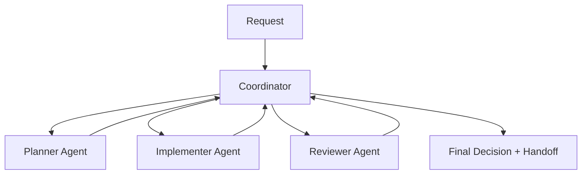

# GH-600 Companion: Multi-Agent Orchestration Spec (Financius Web)

## Objective

Define a practical multi-agent workflow for GH-600 Domain 5 (Orchestrate multi-agent coordination), using this repository as the execution environment.

This spec establishes:
- role boundaries
- handoff artifacts
- conflict detection and resolution
- failure handling and recovery
- observability requirements

## What GH-600 Is Testing Here

This domain is not satisfied by saying "use multiple agents."

GH-600 is testing whether you can:
- justify why work is split across roles
- preserve enough structure in handoffs that the next role does not have to guess
- detect when a workflow is moving quickly but becoming less trustworthy
- decide when the coordinator should stop progress and escalate

---

## Orchestration Pattern

Use a coordinator-driven pattern with three worker roles.



Coordinator responsibilities:
- decompose work into tasks
- assign scope and constraints
- gate transitions between phases
- resolve conflicts across outputs
- escalate when policy/risk thresholds are met

Study note:
- the coordinator is not just a dispatcher; it is the control point that keeps planning, implementation, and review from collapsing together

---

## Agent Roles And Boundaries

## 1) Planner Agent
Inputs:
- request context
- relevant code/docs files
- repo constraints (`CLAUDE.md`, CI, policy docs)

Outputs:
- structured plan
- files-in-scope list
- risk profile
- validation checklist
- rollback notes

Hard constraints:
- no code writes
- no deployment actions

## 2) Implementer Agent
Inputs:
- approved planner artifact
- exact files and acceptance criteria

Outputs:
- code/docs changes
- execution log (commands run)
- self-check results

Hard constraints:
- stay within approved scope unless escalated
- no high-risk operations without approval

## 3) Reviewer Agent
Inputs:
- planner artifact
- diff/change set
- test and lint outputs

Outputs:
- findings by severity
- regression and contract risks
- go/no-go recommendation

Hard constraints:
- no code modification during review phase
- must provide evidence references

## Why These Role Boundaries Matter

If the planner edits code, you lose a clean planning artifact.
If the implementer changes scope, you lose trustworthy execution boundaries.
If the reviewer edits code while reviewing, you lose an independent assessment surface.

That separation is the real subject of the exam, not the number of agents.

---

## Mandatory Handoff Artifact Schema

Every phase handoff must include this structure:

```yaml
task_id: GH600-<date>-<id>
phase: planning|implementation|review
owner: planner|implementer|reviewer
inputs:
  - file_or_doc_refs
outputs:
  - artifact_refs
decisions:
  - decision
risks:
  - risk_and_severity
validation:
  commands:
    - command
  results:
    - pass_or_fail_summary
next_action: explicit_next_step
escalation_required: true|false
```

Store artifacts under:
- `docs/gh600/runs/<task_id>/`

## Worked Handoff Example

```yaml
task_id: GH600-20260531-01
phase: planning
owner: planner
inputs:
  - docs/gh600/domain-4-evaluation-and-tuning.md
  - backend/tests/dj/contract/test_envelope_contract.py
outputs:
  - docs/gh600/runs/GH600-20260531-01/planner.md
decisions:
  - limit scope to envelope-related docs and tests
risks:
  - changing API views would escalate contract risk
validation:
  commands:
    - pytest tests/dj/contract/test_envelope_contract.py -q
  results:
    - not yet run
next_action: implementer may edit docs and tests only
escalation_required: false
```

This example is intentionally narrow. A good handoff tells the next role what is authorized, not just what is desired.

---

## Conflict Detection Rules

A conflict is raised when any of the following occur:
1. overlapping edits to same logical area with contradictory intent
2. planner scope differs from implemented file set
3. reviewer identifies contract mismatch against envelope/API guarantees
4. test results invalidate planner assumptions

Conflict signals to monitor:
- changed files outside approved list
- failing contract tests after implementation
- contradictory recommendations between planner and reviewer

## Worked Conflict Scenario

Scenario:
- planner approves docs and tests only
- implementer edits an API view as well
- reviewer flags contract risk because the changed file could alter response behavior

Correct coordinator response:
1. freeze further writes
2. compare actual changed files against approved scope
3. prioritize contract correctness over delivery speed
4. either narrow the implementation back to approved scope or escalate for a new plan

This is the kind of conflict reasoning GH-600 is likely to reward.

---

## Conflict Resolution Protocol

Step sequence:
1. coordinator freezes further writes
2. assemble conflict packet:
   - conflicting outputs
   - affected files
   - validation evidence
3. apply priority order:
   - security/compliance > contract correctness > data integrity > feature speed
4. choose one path:
   - accept reviewer block and request revision
   - narrow scope and re-run implementation
   - escalate to human decision
5. log decision and rationale in run artifact

---

## Failure And Recovery Patterns

## Failed execution
- symptom: command/test failure blocks progress
- action: classify root cause (tool/env/spec/context), retry if transient, else escalate

## Partial completion
- symptom: subset of tasks completed but criteria unmet
- action: produce partial artifact, mark pending items, return to planner for re-scope

## Stalled workflow
- symptom: repeated loops with no net progress
- action: coordinator triggers human-in-the-loop checkpoint

## Rollback-required condition
- symptom: regressions in contract/security/data integrity
- action: revert affected change set and reopen planning phase

Why this matters for study:
- the workflow must be able to move backward cleanly when correctness is at risk
- a "multi-agent" label is meaningless if the system cannot recover from a bad handoff or invalid execution path

---

## Observability Requirements

Each run must capture:
1. task intent and constraints
2. per-agent output artifacts
3. command/test/build evidence
4. conflict and escalation events
5. final disposition and follow-up actions

Minimum evidence for go decision:
- lint pass
- backend tests pass (`pytest tests/dj -q`)
- required contract checks pass
- no unresolved critical findings

## What A Strong Exam Answer Sounds Like

For this repo, a strong answer would say:
- use planner, implementer, and reviewer roles with distinct permissions
- require a coordinator to freeze work on scope or contract conflict
- preserve handoff artifacts under a predictable run folder
- rely on evidence, not role confidence, for go or no-go decisions

---

## Lifecycle Management

## Add an agent
- define role charter and allowed actions
- update handoff schema if new fields needed
- run one shadow cycle before production use

## Replace an agent
- preserve old run artifacts and decision history
- run side-by-side comparison on one task
- promote replacement only after equivalent or better outcomes

## Retire an agent
- document retirement reason
- reassign responsibilities explicitly
- preserve audit continuity in historical run folder

---

## Pilot Run Plan For This Repo

Use this medium-scope pilot:
- target: improve one backend endpoint and matching tests
- planner: define scope + risk + validation
- implementer: execute changes in approved files
- reviewer: perform contract/regression review
- coordinator: produce final go/no-go summary

Expected deliverables:
- run folder under `docs/gh600/runs/`
- complete handoff artifacts for all 3 phases
- conflict log (empty or populated)
- final recommendation

This establishes direct GH-600 competency evidence for multi-agent coordination.

## Self-Check

1. Why is a coordinator not interchangeable with a planner?
2. What information must be present for a handoff to be safe?
3. When should a workflow freeze instead of continuing with a reviewer warning?
4. Why is "multiple agents for speed" an incomplete orchestration answer?
