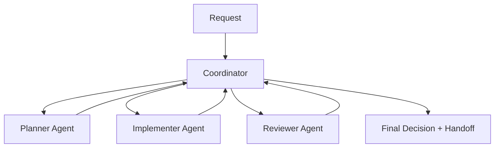

# GH-600 Companion: Multi-Agent Orchestration Spec (Financius Web)

## Objective

Define a practical multi-agent workflow for GH-600 Domain 5 (Orchestrate multi-agent coordination), using this repository as the execution environment.

This spec establishes:
- role boundaries
- handoff artifacts
- conflict detection and resolution
- failure handling and recovery
- observability requirements

---

## Orchestration Pattern

Use a coordinator-driven pattern with three worker roles.



Coordinator responsibilities:
- decompose work into tasks
- assign scope and constraints
- gate transitions between phases
- resolve conflicts across outputs
- escalate when policy/risk thresholds are met

---

## Agent Roles And Boundaries

## 1) Planner Agent
Inputs:
- request context
- relevant code/docs files
- repo constraints (`CLAUDE.md`, CI, policy docs)

Outputs:
- structured plan
- files-in-scope list
- risk profile
- validation checklist
- rollback notes

Hard constraints:
- no code writes
- no deployment actions

## 2) Implementer Agent
Inputs:
- approved planner artifact
- exact files and acceptance criteria

Outputs:
- code/docs changes
- execution log (commands run)
- self-check results

Hard constraints:
- stay within approved scope unless escalated
- no high-risk operations without approval

## 3) Reviewer Agent
Inputs:
- planner artifact
- diff/change set
- test and lint outputs

Outputs:
- findings by severity
- regression and contract risks
- go/no-go recommendation

Hard constraints:
- no code modification during review phase
- must provide evidence references

---

## Mandatory Handoff Artifact Schema

Every phase handoff must include this structure:

```yaml
task_id: GH600-<date>-<id>
phase: planning|implementation|review
owner: planner|implementer|reviewer
inputs:
  - file_or_doc_refs
outputs:
  - artifact_refs
decisions:
  - decision
risks:
  - risk_and_severity
validation:
  commands:
    - command
  results:
    - pass_or_fail_summary
next_action: explicit_next_step
escalation_required: true|false
```

Store artifacts under:
- `docs/gh600/runs/<task_id>/`

---

## Conflict Detection Rules

A conflict is raised when any of the following occur:
1. overlapping edits to same logical area with contradictory intent
2. planner scope differs from implemented file set
3. reviewer identifies contract mismatch against envelope/API guarantees
4. test results invalidate planner assumptions

Conflict signals to monitor:
- changed files outside approved list
- failing contract tests after implementation
- contradictory recommendations between planner and reviewer

---

## Conflict Resolution Protocol

Step sequence:
1. coordinator freezes further writes
2. assemble conflict packet:
   - conflicting outputs
   - affected files
   - validation evidence
3. apply priority order:
   - security/compliance > contract correctness > data integrity > feature speed
4. choose one path:
   - accept reviewer block and request revision
   - narrow scope and re-run implementation
   - escalate to human decision
5. log decision and rationale in run artifact

---

## Failure And Recovery Patterns

## Failed execution
- symptom: command/test failure blocks progress
- action: classify root cause (tool/env/spec/context), retry if transient, else escalate

## Partial completion
- symptom: subset of tasks completed but criteria unmet
- action: produce partial artifact, mark pending items, return to planner for re-scope

## Stalled workflow
- symptom: repeated loops with no net progress
- action: coordinator triggers human-in-the-loop checkpoint

## Rollback-required condition
- symptom: regressions in contract/security/data integrity
- action: revert affected change set and reopen planning phase

---

## Observability Requirements

Each run must capture:
1. task intent and constraints
2. per-agent output artifacts
3. command/test/build evidence
4. conflict and escalation events
5. final disposition and follow-up actions

Minimum evidence for go decision:
- lint pass
- backend tests pass (`pytest tests/dj -q`)
- required contract checks pass
- no unresolved critical findings

---

## Lifecycle Management

## Add an agent
- define role charter and allowed actions
- update handoff schema if new fields needed
- run one shadow cycle before production use

## Replace an agent
- preserve old run artifacts and decision history
- run side-by-side comparison on one task
- promote replacement only after equivalent or better outcomes

## Retire an agent
- document retirement reason
- reassign responsibilities explicitly
- preserve audit continuity in historical run folder

---

## Pilot Run Plan For This Repo

Use this medium-scope pilot:
- target: improve one backend endpoint and matching tests
- planner: define scope + risk + validation
- implementer: execute changes in approved files
- reviewer: perform contract/regression review
- coordinator: produce final go/no-go summary

Expected deliverables:
- run folder under `docs/gh600/runs/`
- complete handoff artifacts for all 3 phases
- conflict log (empty or populated)
- final recommendation

This establishes direct GH-600 competency evidence for multi-agent coordination.
